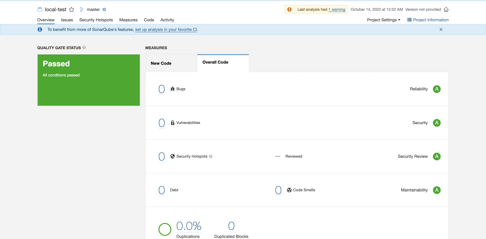

# sonarqube



## Tools
sonar-scanner: https://formulae.brew.sh/formula/sonar-scanner

## Run Project
Run Docker-compose:
```
$ docker-compose up -d
```

Sonar Dashboard: http://127.0.0.1:9000

## Access
Login: admin
Password: admin / sonar

Token: sonartoken

## Usage
```sh
sonar-scanner \
  -Dsonar.projectKey=local-test \
  -Dsonar.sources=. \
  -Dsonar.host.url=http://127.0.0.1:9000 \
  -Dsonar.login=3a1f2991c5c457c0c8b99f3d2e1d9e1d7f4f8203
```

## Additional info
Using sonarqube for arm: https://hub.docker.com/r/koolwithk/sonarqube-arm

Source: https://github.com/SonarSource/docker-sonarqube/blob/master/example-compose-files/sq-with-postgres/docker-compose.yml