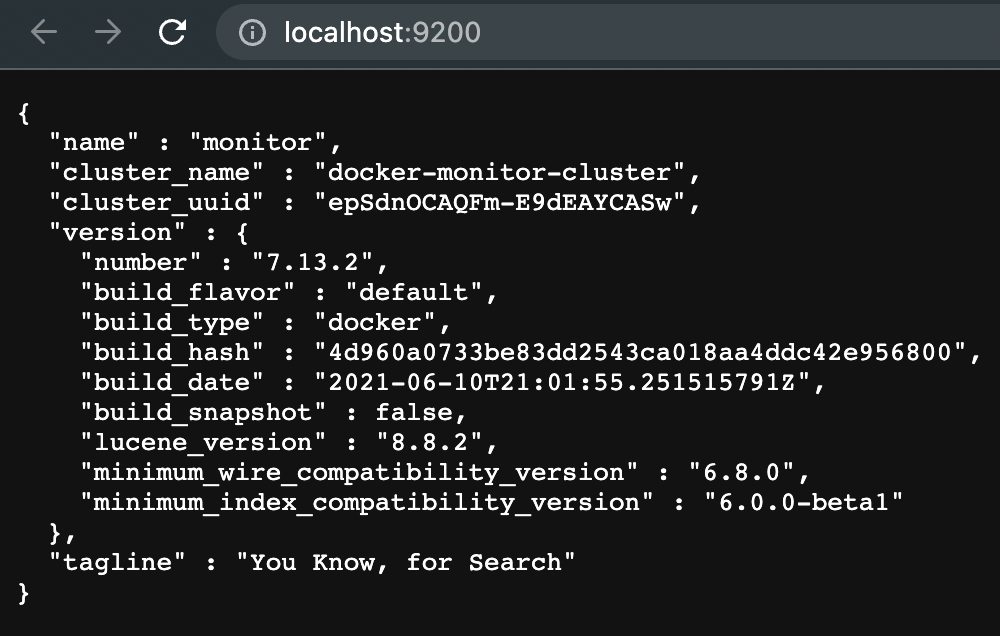

# Elasticsearch and Kibana
This is simple setup for elasticsearch and kibana



## Docker
### Docker & docker-compose Installation
On Mac:
[`Installation Docker with Mac`](https://docs.docker.com/docker-for-mac/install/)

Try to check docker version:
```bash
$ docker --version
$ docker-compose version
```

## Elasticsearch with Docker Compose
### Create docker compose for Elasticsearch and Kibana
Create file with name `docker-compose.yml` and type this example configuration into file:
```yml
version: "2"

services:
  elasticsearch1:
    image: docker.elastic.co/elasticsearch/elasticsearch:7.13.2
    container_name: elasticsearch1
    environment:
     - cluster.name=docker-cluster
     - node.name=elasticsearch1
     - "ES_JAVA_OPTS=-Xms512m -Xmx512m"
     - xpack.monitoring.collection.enabled=true
     - xpack.monitoring.exporters.remote.type=http
     - xpack.monitoring.exporters.remote.host=monitor
     - discovery.seed_hosts=elasticsearch1,elasticsearch2,elasticsearch3
     - cluster.initial_master_nodes=elasticsearch1,elasticsearch2,elasticsearch3
    ports:
      - "19200:9200"

  elasticsearch2:
    image: docker.elastic.co/elasticsearch/elasticsearch:7.13.2
    container_name: elasticsearch2
    environment:
     - cluster.name=docker-cluster
     - node.name=elasticsearch2
     - "ES_JAVA_OPTS=-Xms512m -Xmx512m"
     - xpack.monitoring.collection.enabled=true
     - xpack.monitoring.exporters.remote.type=http
     - xpack.monitoring.exporters.remote.host=monitor
     - discovery.seed_hosts=elasticsearch1,elasticsearch2,elasticsearch3
     - cluster.initial_master_nodes=elasticsearch1,elasticsearch2,elasticsearch3
    ports:
      - "29200:9200"

  elasticsearch3:
    image: docker.elastic.co/elasticsearch/elasticsearch:7.13.2
    container_name: elasticsearch3
    environment:
     - cluster.name=docker-cluster
     - node.name=elasticsearch3
     - "ES_JAVA_OPTS=-Xms512m -Xmx512m"
     - xpack.monitoring.collection.enabled=true
     - xpack.monitoring.exporters.remote.type=http
     - xpack.monitoring.exporters.remote.host=monitor
     - discovery.seed_hosts=elasticsearch1,elasticsearch2,elasticsearch3
     - cluster.initial_master_nodes=elasticsearch1,elasticsearch2,elasticsearch3
    ports:
      - "39200:9200"

  monitor:
    image: docker.elastic.co/elasticsearch/elasticsearch:7.13.2
    container_name: monitor
    environment:
     - cluster.name=docker-monitor-cluster
     - node.name=monitor
     - "ES_JAVA_OPTS=-Xms512m -Xmx512m"
     - xpack.monitoring.collection.enabled=false
     - discovery.seed_hosts=monitor
     - cluster.initial_master_nodes=monitor
    ports:
      - "9200:9200"

  kibana-devtools:
    image: docker.elastic.co/kibana/kibana:7.13.2
    container_name: kibana-devtools
    environment:
      ELASTICSEARCH_HOSTS: http://elasticsearch3:9200
    ports:
      - "15601:5601"

  kibana-dashboard:
    image: docker.elastic.co/kibana/kibana:7.13.2
    container_name: kibana-dashboard
    environment:
      ELASTICSEARCH_HOSTS: http://monitor:9200
    ports:
      - "25601:5601"
```

In this case, I'm creating 6 containers:
* elasticsearch1 (elasticsearch for node 1)
* elasticsearch2 (elasticsearch for node 2)
* elasticsearch3 (elasticsearch for node 3)
* monitor elasticsearch (:9200)
* kibana-devtools (:15601)
* kibana-dashboard (:25601)

### Run Docker Compose
To run docker compose:
```bash
$ docker-compose up -d
$ docker ps
```

Make sure all containers running to check monitor.
```
http://localhost:9200
```